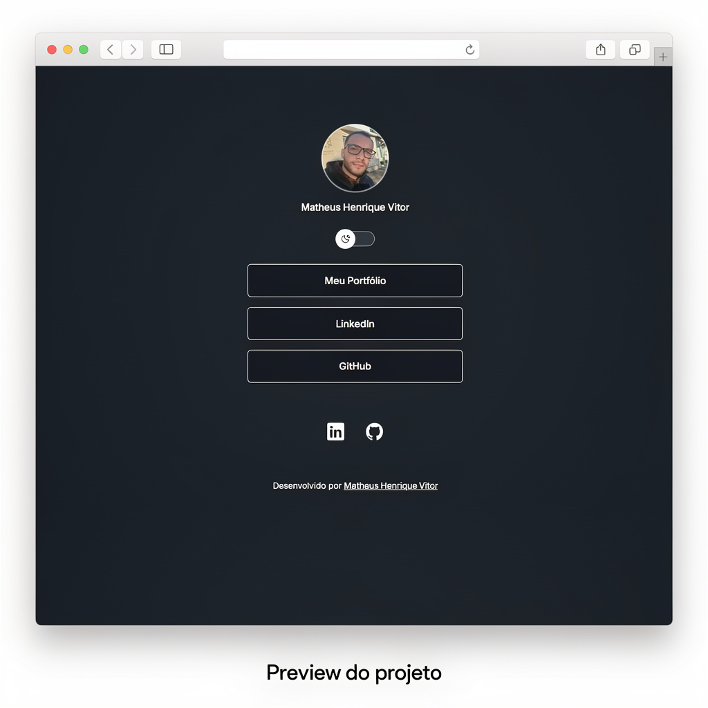

# 🚀 DevLinks

  
  
  
  
  

  <b>Um agregador de links pessoais moderno para reunir redes sociais e projetos em uma única página.</b>

---

# 📸 Preview

---

# 🌐 Acesse o Projeto

🔗 **Deploy do projeto**

https://matheushnrv.github.io/devlinks_discovery/

---

# 🛠️ Tecnologias Utilizadas

Este projeto foi desenvolvido com:

- **HTML5** → Estrutura da página
- **CSS3** → Estilização e layout
- **JavaScript** → Interatividade
- **Git** → Controle de versão
- **GitHub** → Hospedagem do projeto
- **Figma** → Design do projeto

---

# ⚙️ Funcionalidades

✔️ Página de perfil com avatar 
✔️ Links para redes sociais 
✔️ Layout responsivo 
✔️ Alternância de tema **Dark / Light** 
✔️ Interface simples e moderna 

---

# 📂 Estrutura do Projeto

devlinks_discovery 
│ 
├── assets 
│ ├── avatar.png 
│ ├── preview.png 
│ └── icons 
│ 
├── index.html 
├── style.css 
└── script.js 

---

# 🚀 Como Executar o Projeto

### 1️⃣ Clone o repositório

git clone https://github.com/matheushnrv/devlinks_discovery.git

### 2️⃣ Acesse a pasta do projeto

cd devlinks_discovery

### 3️⃣ Abra o projeto no navegador

Abra o arquivo:

index.html

---

# 🧠 Aprendizados

Durante o desenvolvimento deste projeto foram praticados:

- Estruturação de páginas com **HTML**
- Estilização moderna com **CSS**
- Manipulação do **DOM com JavaScript**
- Controle de versão com **Git**
- Publicação de projeto no **GitHub Pages**
- Leitura e interpretação de design com **Figma**

---

# 👨‍💻 Autor

**Matheus Henrique Vitor**

GitHub
https://github.com/matheushnrv

---

⭐ Se você gostou do projeto, considere **dar uma estrela no repositório**.
